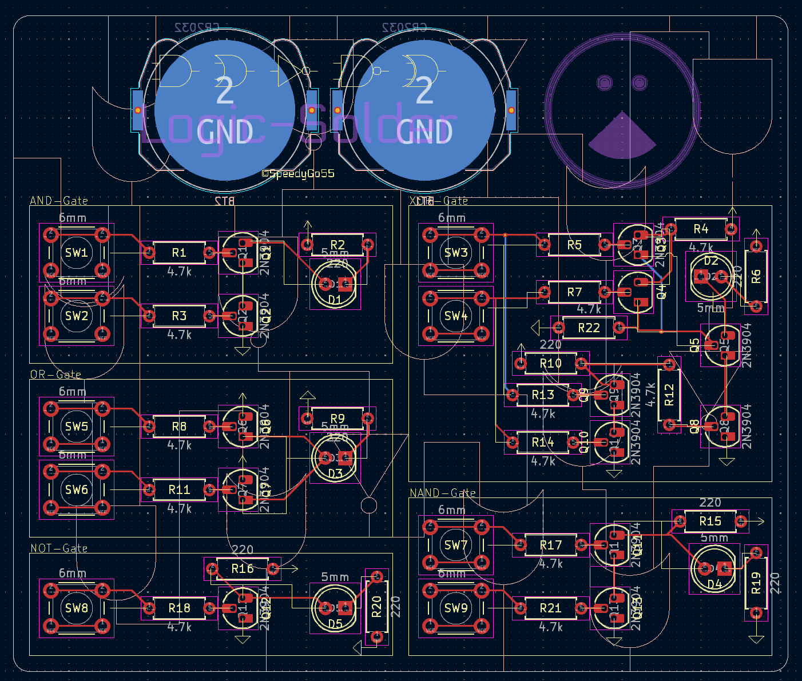
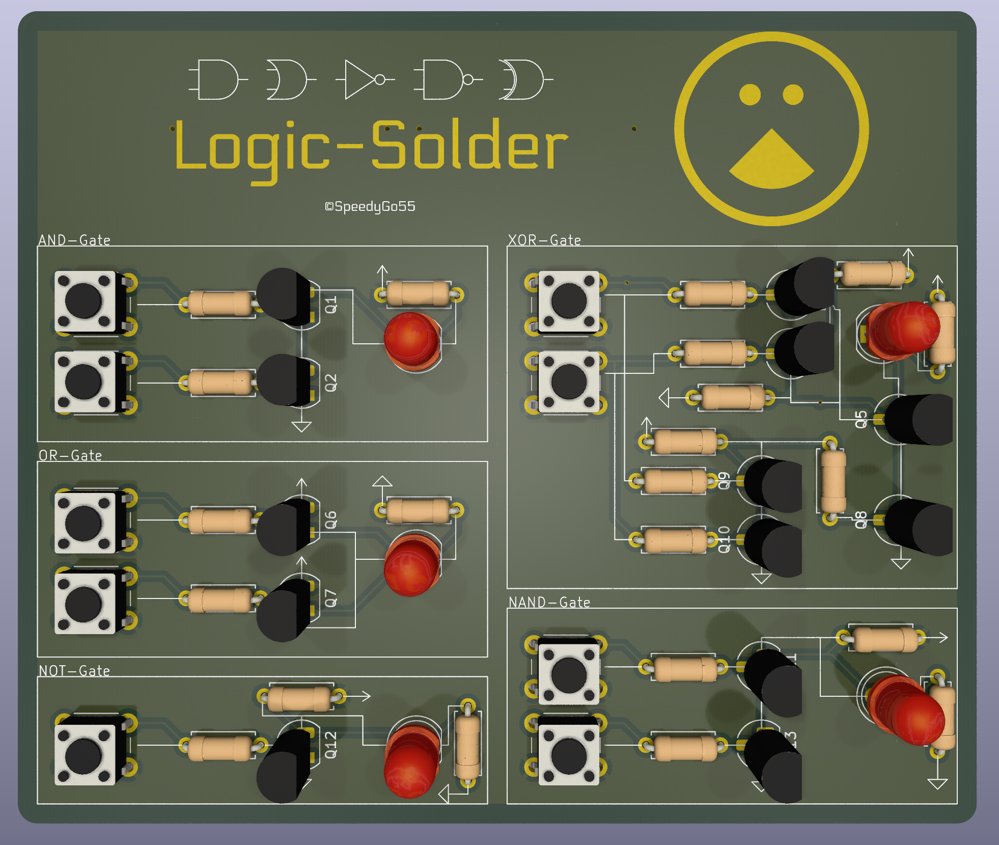

# logic-solder
A PCB by SpeedyGo55 that demonstrates Logic-Gates using Transistors and can serve as a Cheatsheet for building Logic-Gates on a Schematic

# BOM
| Quantity | Part                  |
|----------|-----------------------|
| 21       | 220 Ohm Resistors     |
| 1        | 4.7k Ohm Resistor     |
| 5        | 5mm LEDs              |
| 9        | 6mm Push Button       |
| 13       | 2N3904 Transistors    |
| 2        | CR2032 Battery Holder |
For more Information look at [ibom.html](ibom.html)

# Pictures

